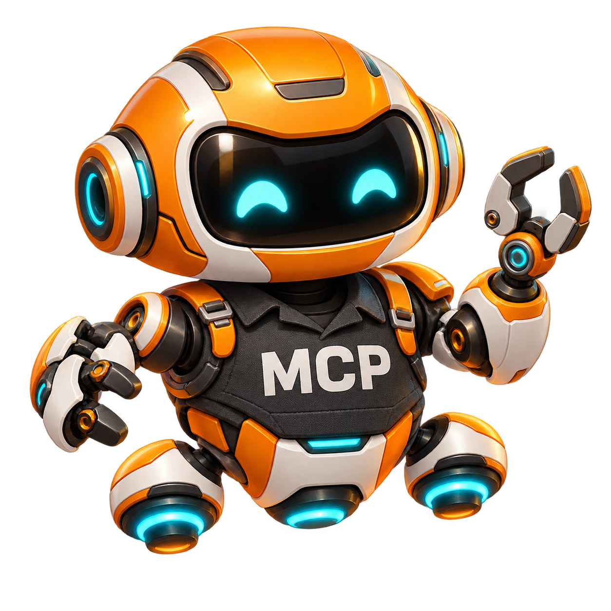
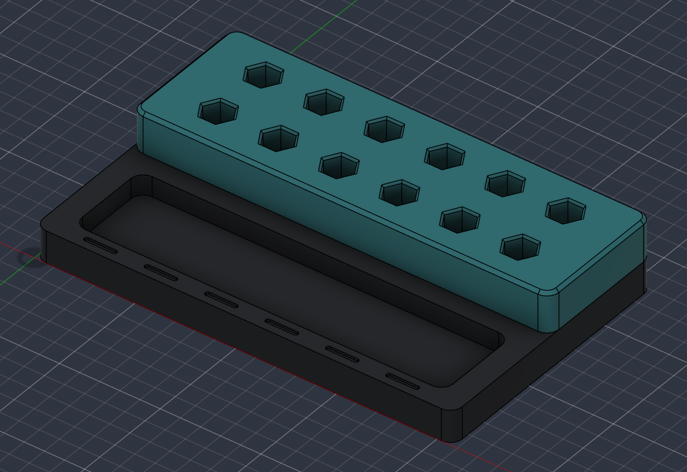

<p align="center"></p>

# Fusion MCPilot

**Your workshop drone for editable CAD.**

[](https://github.com/jnsanders1983/fusion-mcpilot/actions/workflows/checks.yml)
[](LICENSE)
[](https://agentskills.io/specification)
[](https://m8ven.ai/mcp/jnsanders1983/fusion-mcpilot?s=readme)

**A portable AI agent skill for Autodesk Fusion 360 over MCP.** Model with native Fusion features, inspect live CAD state, change parameters, validate geometry, and prepare metric 3D print deliverables with reusable workflows.

Fusion MCPilot connects an agent to **Fusion's existing MCP service**. This repository supplies the skill, recipes, validation, and optional client helpers; it does not install a replacement Fusion MCP server. It is an independent community project, not affiliated with or endorsed by Autodesk, OpenAI, or Prusa Research.

## Start here

1. Install Autodesk Fusion and enable its local MCP service. Copy the address shown in your Fusion application.
2. Download this repository using **Code → Download ZIP**, extract it, and install the complete `fusion-360-mcp` folder in your agent's skill directory.
3. Register the Fusion endpoint in that agent's MCP settings. A common local address is `http://127.0.0.1:27182/mcp`; use the address on your computer.
4. Start with: “Use Fusion MCPilot to inspect my active design and report its bodies, parameters, and unhealthy features. Do not modify it.”

See [installation for ChatGPT Work, Codex, Claude Code, Cursor, and other agents](docs/installation.md), including per-computer configuration, permissions, updates, and troubleshooting.

Try: “Create a parametric metric socket organizer, ask me where to save it, and report verification time.” Or: “Check my selected solid regions for interference before a multi-material export.” See [example prompts](docs/examples.md) for scoped starting points.

If MCPilot helps your CAD workflow, **star this repository** to help others find it. Reproducible bug reports and verified examples help it improve.

The optional Windows adapter installs into the existing Codex personal skill location:

```powershell
& '.\Install.ps1' -SkipConnection
```

Configure MCP separately in your host. For replacement of an existing installation, pass `-ReplaceSkill`; the installer retains a backup. The stable skill identifier stays `fusion-360-mcp`, while the displayed name is **Fusion MCPilot**.

For macOS or a Linux agent connected to a supported Fusion host, use `sh ./Install.sh --agent claude` (or `cursor` / `codex`). The portable Python installer configures only the skill; see the platform notes in the [installation guide](docs/installation.md).

## What you can do



*A real workflow example: constrained parametric modeling, separate solid color regions, and metric print preparation. Fusion viewport capture; physical print testing remains open.*

| Workflow | Implementation and verification |
| --- | --- |
| Primitives | Native sphere, torus, cone, cylinder and frustum; live solid, bounds, volume and health checks |
| Feature modeling | Native extrude, loft, revolve, straight sweep, shell, fillet, chamfer, boolean and patterns within documented recipe contracts |
| Parametric organizers | Constrained sketches and native patterns; size and pitch drive socket counts; verify regenerated geometry |
| Inspection and assemblies | Live body selection, occurrence paths, full transform chains, distance and interference queries |
| Recovery and delivery | Native F3D/STEP, single-body STL/3MF, viewport previews; explicit output destinations |
| Multi-material preparation | Separate solid regions, interference checks, placement and topology validation; see [export policy](fusion-360-mcp/references/multi-material.md) |
| Robust execution | No automatic mutation replay, external settings, bounded parsing and timing records |

The guidance also maps Fusion manufacturing, drawings, Electronics, paid capabilities and extensions. Guidance is not a claim that every Fusion UI feature is automated or every subscription feature is available. [Supported scope and evidence](docs/testing.md) distinguish live tests, offline tests and user observations.

## Native first

Research unfamiliar operations before implementation. Prefer supported Fusion modeling/export features and established tools. Independent validators check outputs; they are not replacements for native CAD operations. A legacy custom multipart writer remains explicitly selectable for diagnostics and experiments. Do not silently choose it over Fusion's native export. Unsupported assembly/subset cases must be explained before choosing a custom implementation.

## Portable layout

```text
fusion-360-mcp/         # Complete installable Agent Skills directory
  SKILL.md             # Agent instructions; progressive reference loading
  agents/openai.yaml   # Optional display name, mascot and host metadata
  scripts/             # Reusable Python helpers and offline tests
  references/          # Task-specific contracts and capability guidance
  assets/              # Generic fixtures and mascot
docs/                  # Installation, architecture, evidence and maintenance
Install.ps1            # Optional Windows host adapter
```

Machine addresses, credentials, approval preferences, CAD projects and execution records belong outside the skill. Keep one repository source of truth; installed copies are deployment targets, not independently edited sources. [Architecture and maintenance](docs/architecture.md).

## Development checks

Python helpers use the standard library, Python 3.11+. Use a maintained, patched runtime; XML validation additionally requires Expat 2.7.2 or later.

```sh
python -B -m unittest discover -s fusion-360-mcp/scripts -p '*test*.py'
python -B fusion-360-mcp/scripts/package_skill.py --package-root . --skill-name fusion-360-mcp --zip-path fusion-mcpilot.zip
```

Offline checks do not require Fusion. Live tests require a supported Fusion host and explicit disposable documents. [Contributing](CONTRIBUTING.md) · [Security](SECURITY.md) · [Changes](CHANGELOG.md).

## Performance

Every Fusion operation should report execution-and-verification time with its scope. MCP round trip, in-Fusion execution, and helper total are separate from the user's prompt-to-answer wait. No published execution measurement is a guarantee of total agent response latency.

## License and branding

Code and documentation are provided under [MIT](LICENSE). The original MCPilot mascot was generated for this project and is included under the same project license, subject to any applicable rights. Autodesk and Fusion are their owners' trademarks; the mascot is not an Autodesk logo. Do not imply official endorsement.

[](https://m8ven.ai/mcp/jnsanders1983-fusion-mcpilot-u3pyuq?s=readme)
